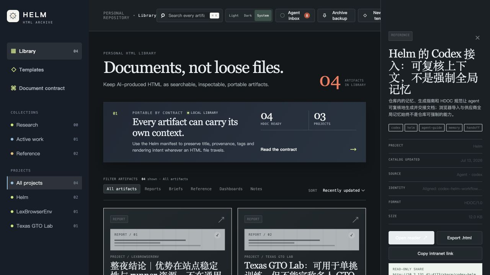

# Helm

[](https://github.com/waple0820/Helm/actions/workflows/verify.yml)
[](LICENSE)

<p align="center">
  
</p>

<p align="center"><strong>A local-first artifact repository for work produced by AI agents.</strong></p>

Helm keeps finished HTML reports, briefs, dashboards, and research as durable project artifacts. It preserves the original file, makes its contract inspectable, and gives people—not agents—the final say over what enters a personal library or gets shared.



## Why Helm

- **Originals remain evidence.** Helm indexes, exports, backs up, and shares the exact HTML bytes; it never silently rewrites the source artifact.
- **Agents have a contract.** `HDOC/1.0`, report templates, and the checked-in agent guide make artifacts portable across projects and agents.
- **The owner keeps control.** Agent output arrives in a reviewable inbox. Browser storage, imports, and intranet publication remain deliberate human actions.
- **Artifacts have history.** Immutable revisions, Draft / Reviewed / Published state, visual comparison, Fork lineage, and a stable Channel address keep change legible without rewriting evidence.

## Start in one minute

The machine running Helm-aware agents must have outbound Internet access so it can clone or update the repository and let agents reach the external sources used in their reports. The Helm library itself has no third-party runtime dependency and can continue serving retained local artifacts after the repository has been cloned.

```bash
git clone https://github.com/waple0820/Helm.git
cd html-displayer

# Browser library + optional read-only intranet sharing service.
python3 helm_share_server.py --host 127.0.0.1 --port 4173
```

Open [http://127.0.0.1:4173](http://127.0.0.1:4173). The library is stored in that browser's IndexedDB; no account, cloud sync, build step, or external font is required.

## How an artifact moves

```text
Agent / project
  └─ complete HDOC/1.0 HTML
       └─ Helm Bridge inbox ── owner review ──> browser library (IndexedDB)
             │                                      │
             └─ exact original bytes                ├─ HARC backup / explicit folder sync
                                                    └─ reviewed Channel + immutable Revisions
```

The important boundary is deliberate: submitting to the Bridge is a handoff, not permission to modify the browser library.

## Hand an artifact to Helm

For the machine that owns the library, bootstrap the loopback Bridge once:

```bash
scripts/helm-agent-bootstrap --agent-name codex
```

From the project that produced a final report, brief, reference note, or dashboard:

```bash
/path/to/html-displayer/scripts/helm-submit output.html --source "your-agent-name"
```

The final artifact appears in **Agent inbox** for review and explicit import. Read [`AGENTS.md`](AGENTS.md) first when authoring with an agent; [`AI-GUIDE.md`](AI-GUIDE.md) contains the concise generation entry point.

## Repository guide

| Path | Purpose |
| --- | --- |
| [`index.html`](index.html), [`app.js`](app.js), [`channel-store.js`](channel-store.js), [`styles.css`](styles.css) | Static browser library, Artifact / Revision store, safe reader, and interface. |
| [`validator.js`](validator.js) | Browser-side `HDOC/1.0` inspection and portability warnings. |
| [`helm_bridge.py`](helm_bridge.py) | Loopback-only agent ingress and immutable inbox records. |
| [`helm_share_server.py`](helm_share_server.py) | Static app plus owner-only publication of immutable read-only share links. |
| [`docs/`](docs/) | Format contract, architecture, report design, storage, Bridge, and sharing references. |
| [`templates/`](templates/) | Complete standalone report starters with visual evidence patterns. |
| [`scripts/`](scripts/) | Clone bootstrap and final agent handoff commands. |
| [`tests/`](tests/) | Contract, Bridge, share-store, and template regression checks. |

Read [`docs/ARCHITECTURE.md`](docs/ARCHITECTURE.md) for the data boundaries and [`docs/HTML-DOCUMENT-SPEC.md`](docs/HTML-DOCUMENT-SPEC.md) for the interoperable artifact contract.

## Develop and verify

Helm has no package-install step. Run the same checks used by CI:

```bash
python3 -m unittest discover -s tests -p 'test_*.py'
python3 -m http.server 4183 --bind 127.0.0.1
```

Open the browser smoke pages at `http://127.0.0.1:4183/tests/contract-smoke.html`, `channel-store-smoke.html`, and `repair-smoke.html`. The production share server deliberately blocks `/tests`; use this isolated static development port for browser checks.

For a reviewed remote intranet installation, use [`scripts/deploy-remote`](scripts/deploy-remote). It deploys only the committed tree, tests it before activation, keeps runtime shares outside the release, and rolls back a failed health check. See [`docs/INTRANET-SHARING.md`](docs/INTRANET-SHARING.md).

## Scope and boundaries

Helm is intentionally a single-person, local-first archive. It does not provide cloud sync, multi-user collaboration, a WYSIWYG editor, background filesystem watching, RAG chat, OCR, or a mobile app. Those belong only after the original-file, recovery, and handoff contracts prove durable.

## Documentation

- [`AGENTS.md`](AGENTS.md) — instructions for coding agents entering the repository.
- [`AI-GUIDE.md`](AI-GUIDE.md) — concise HTML generation and handoff guide.
- [`docs/HTML-DOCUMENT-SPEC.md`](docs/HTML-DOCUMENT-SPEC.md) — `HDOC/1.0` interchange contract.
- [`docs/REPORT-DESIGN-STANDARD.md`](docs/REPORT-DESIGN-STANDARD.md) — answer-first report and visual-evidence standard.
- [`docs/AGENT-BRIDGE.md`](docs/AGENT-BRIDGE.md) — Bridge API, security model, and conflict semantics.
- [`docs/LOCAL-ARCHIVE-LAYOUT.md`](docs/LOCAL-ARCHIVE-LAYOUT.md) — portable `HARC/1.0` archive format.
- [`docs/INTRANET-SHARING.md`](docs/INTRANET-SHARING.md) — owner-controlled immutable sharing model.
- [`docs/CHANNELS.md`](docs/CHANNELS.md) — Artifact, Revision, publication, comparison, and Fork semantics.

## Contributing and security

Contributions are welcome. Please read [`CONTRIBUTING.md`](CONTRIBUTING.md), preserve the immutable-original and no-secret boundaries, and run the verification command before opening a pull request. Helm is released under the [MIT License](LICENSE).
